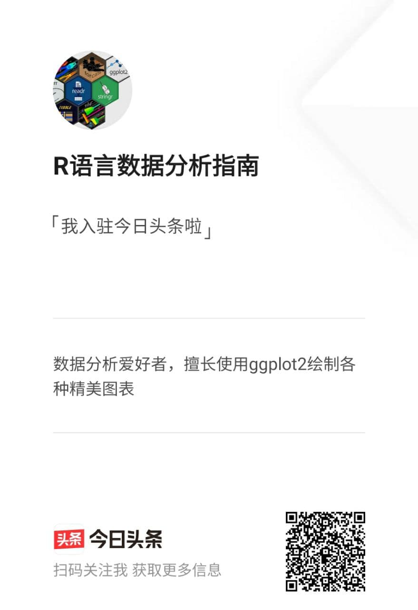

```{r, include=FALSE}
knitr::opts_chunk$set(echo = FALSE,
                      warning = FALSE,
                      tidy = FALSE,
                      message = FALSE,
                      fig.align = 'center',
                      out.width = "100%")
options(knitr.table.format = "html") 
```

**本节来介绍如何使用** **posterdown** **包来优雅的制作海报**


# Results-1

```{r myprettycode, echo=TRUE, fig.cap='Boxplots, so hot right now!',fig.height=5, out.width="80%"}

# 加载R包
package.list=c("tidyverse","ggsci","ggsignif")

for (package in package.list) {
  if (!require(package,character.only=T, quietly=T)) {
    install.packages(package)
    library(package, character.only=T)
  }
}

# 数据可视化
ToothGrowth %>% mutate(dose=as.factor(dose)) %>% 
  ggplot(aes(dose,len,fill=supp))+
  geom_violin(position = position_dodge(0.7),
              trim = FALSE,alpha=0.8) + 
  geom_boxplot(position = position_dodge(0.7), 
               width = 0.15,show.legend = F,
               alpha=0.8,color="white") +
  stat_boxplot(geom="errorbar",position=position_dodge(width=0.7),
               width=0.1,alpha=0.8,color="white")+
  geom_signif(comparisons = list(c("0.5","1"),
                                 c("0.5","2"),
                                 c("1","2")),
              map_signif_level=T,vjust=0.5,color="black",
              textsize=5,test=wilcox.test,step_increase=0.1)+
  facet_wrap(.~supp,scales = "free")+
  scale_fill_jco()+
  theme_bw()+
  theme(panel.spacing.x = unit(0.2,"cm"),
        panel.spacing.y = unit(0.1, "cm"),
        axis.title = element_blank(),
        strip.text.x = element_text(size=9,color="black"),
        strip.background.x = element_blank(),
        axis.text = element_text(color="black"),
        axis.ticks.x=element_blank(),
        legend.text = element_text(color="black",size=9),
        legend.title=element_blank(),
        legend.spacing.x=unit(0.1,'cm'),
        legend.key=element_blank(),
        legend.key.width=unit(0.5,'cm'),
        legend.key.height=unit(0.5,'cm'),
        legend.position = "non",
        plot.margin=unit(c(0.3,0.3,0.3,0.3),units=,"cm")) 
```

# Results-2

```{r,echo=TRUE}
knitr::kable(
  iris[1:30,1:5], format = "html",
  caption = "A table made with the **knitr::kable** function.",
  align = "c", col.names = c("Sepal <br> Length",
                             "Sepal <br> Width",
                             "Petal <br> Length",
                             "Petal <br> Width",
                             "Species"),
  escape = FALSE)
```

# Results-3

```{r, irisfigure, fig.cap='Here is a caption for the figure. This can be added by using the "fig.cap" option in the r code chunk options, see this [link](https://yihui.name/knitr/options/#plots) from the legend himself, [Yihui Xie](https://twitter.com/xieyihui).', out.width="80%",echo=TRUE}
par(mar=c(2,2,0,1))
plot(x = iris$Sepal.Length, y = iris$Sepal.Width,
     col = iris$Species, pch = 19, xlab = "Sepal Length",
     ylab = "Sepal Width")
```

# Results-4

```{r mytable, out.width='80%',echo=TRUE}
knitr::kable(iris[1:10, 1:4],
             caption = 'Table caption.',align = 'c',"html")
```



